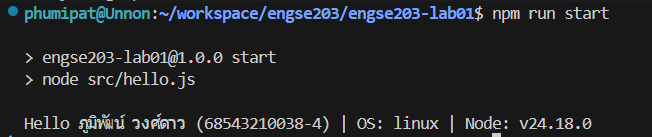

# ENGSE203 LAB 01 — developer-environment-git-github

## ผู้จัดทำ

- ชื่อ-นามสกุล: นายภูมิพัฒน์ วงศ์ดาว
- รหัสนักศึกษา: 68543210038-4
- ระบบปฏิบัติการที่ใช้: macOS / Windows

## วัตถุประสงค์ของงาน

- เมื่อรันเเล้วสามารถเเสดง ชื่อ, รหัส, OS เเละ Node.js version ได้

## เครื่องมือที่ใช้

- Visual Studio Code , WSL Ubuntu24.04

## วิธีติดตั้งและรัน

```bash
# ตัวอย่างคำสั่ง
npm install
npm run start
```

## หลักฐานผลลัพธ์

อธิบายผลลัพธ์ พร้อมแนบภาพหน้าจอหรือข้อความผลลัพธ์ตามที่ใบงานกำหนด

## ปัญหาที่พบและวิธีแก้ไข

- ปัญหา:
- วิธีแก้:

## References & AI Assistance

- Source / Documentation: engse203-lab/labs/week-01-developer-environment-git-github
- AI tool used:
- Used for: engse203-lab01
- My adaptation: